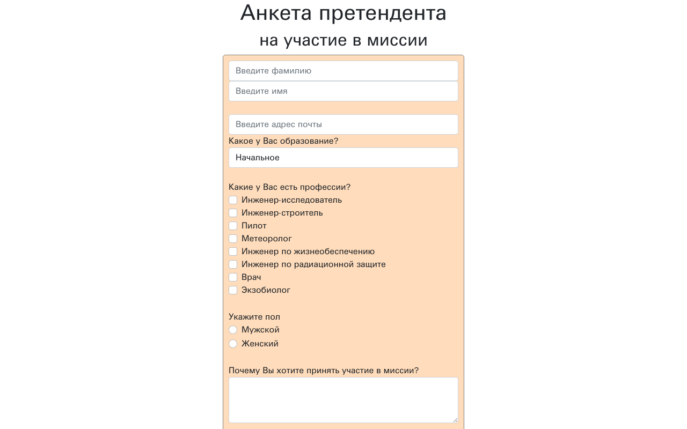

# Yandex Lyceum

**Русский** · [English](README.en.md)

[](https://github.com/EDeev/yandex_lyceum/actions/workflows/ci.yml)

Решения задач курса веб-разработки Яндекс Лицея: Flask-приложения по сюжету «Миссия колонизации Марса»
и поиск организаций через API Яндекс.Карт.

**Статус:** учебный проект (Яндекс Лицей, 2022), завершён, в архиве



**Стек:** Python · Flask · Jinja2 · Flask-WTF · Bootstrap · API Яндекс.Карт · Pillow

| Папка | Что внутри |
|---|---|
| `01-flask-html` | страницы на Flask и Jinja2: рекламная страница миссии, анкета претендента, выбор планеты, результаты отбора, загрузка фото |
| `02-flask-wtf-forms` | формы на Flask-WTF: вход, тренажёры по профессиям, список профессий, автоответ анкеты, распределение по каютам |
| `03-yandex-maps-search` | поиск ближайшей организации через API поиска по организациям и показ карты |

## Запуск

```bash
pip install -r requirements.txt
cd 01-flask-html && python server.py          # http://127.0.0.1:8080
YANDEX_API_KEY=ваш_ключ python 03-yandex-maps-search/main.py
```

Для `03-yandex-maps-search` нужен ключ API поиска по организациям Яндекса в переменной `YANDEX_API_KEY`.

## Лицензия

Учебный проект (Яндекс Лицей, 2021/22). Код открыт для изучения, отдельной лицензии нет.

## Автор

**Деев Егор Викторович** — [GitHub](https://github.com/EDeev) · [Telegram](https://t.me/DeevEgor) · [egor@deev.space](mailto:egor@deev.space)

---

<div align="center">
  <sub>⭐ Если проект оказался полезным, поставьте звёздочку на GitHub!</sub>
  <p><sub>Сделано с ❤️ — <a href="https://deev.space">deev.space</a></sub></p>
</div>
